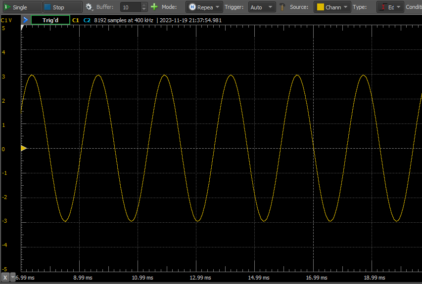
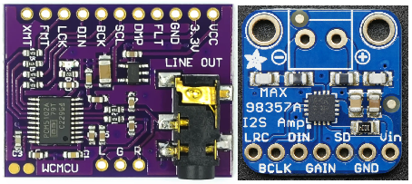

# esp32s3-i2s-test

**Note**: **Requires the newer [ESP-IDF v5 and above](https://github.com/espressif/esp-idf/releases/tag/v5.1.2). Example not compatible with older ESP-IDF versions such as V4.**

Written for [Cytron's Maker Feather AIOT S3](https://my.cytron.io/p-v-maker-feather-aiot-s3-simplifying-aiot-with-esp32), and can be used for other boards featuring ESP32S3 too. :D

This is a simple ESP32S3 <ins>**I2S TX**</ins> test that is modified and stripped down from the ESP-IDF I2S [example](https://github.com/espressif/esp-idf/tree/master/examples/peripherals/i2s/i2s_basic/i2s_std).

The example outputs a 440Hz sine wave to the left channel (task *i2s_example_sinewave*) and using a simple DDS method to generate the sine wave:



You can change the pins according to your setup by modifying the defines:
```
#define EXAMPLE_STD_BCLK_IO1 GPIO_NUM_48 // I2S bit clock io number
#define EXAMPLE_STD_WS_IO1 GPIO_NUM_47   // I2S word select io number
#define EXAMPLE_STD_DOUT_IO1 GPIO_NUM_40 // I2S data out io number
#define EXAMPLE_STD_DIN_IO1 GPIO_NUM_39  // I2S data in io number
```

It works for PCM5102 and MAX98357A modules:


